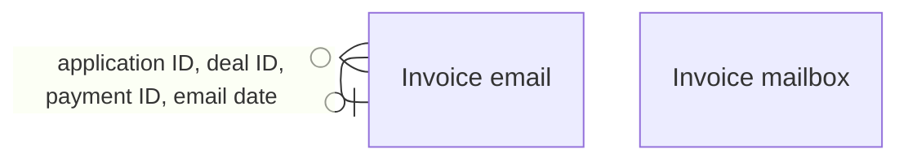

# Invoices

```mermaid
---
config:
  layout: elk
  er:
    nodeSpacing: 22
    rankSpacing: 44
---
erDiagram
  "Invoice email"
  "Invoice mailbox"
  "Invoice email" }o--o| "Invoice email" : "application ID, deal ID, payment ID, email date#160;#160;#160;#160;"
```

## Tables

- [Invoice email](next.invoice_email.md)
- [Invoice mailbox](next.invoice_mailbox.md)

See each table for its columns and links to other areas.
