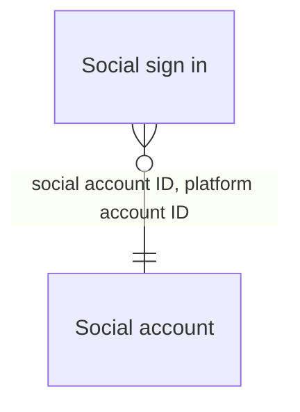

# Social accounts

```mermaid
---
config:
  layout: elk
  er:
    nodeSpacing: 22
    rankSpacing: 44
---
erDiagram
  "Social account"
  "Social sign in"
  "Social sign in" }o--|| "Social account" : "social account ID, platform account ID"
```

## Tables

- [Social account](next.social_account.md)
- [Social sign in](next.social_sign_in.md)

See each table for its columns and links to other areas.
