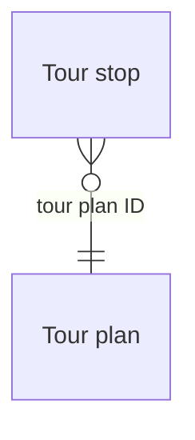

# Tours

```mermaid
---
config:
  layout: elk
  er:
    nodeSpacing: 22
    rankSpacing: 44
---
erDiagram
  "Tour plan"
  "Tour stop"
  "Tour stop" }o--|| "Tour plan" : "tour plan ID"
```

## Tables

- [Tour plan](next.tour_plan.md)
- [Tour stop](next.tour_stop.md)

See each table for its columns and links to other areas.
