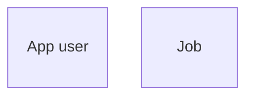

# Users and jobs

```mermaid
---
config:
  layout: elk
  er:
    nodeSpacing: 22
    rankSpacing: 44
---
erDiagram
  "App user"
  "Job"
```

## Tables

- [App user](next.app_user.md)
- [Job](next.job.md)

See each table for its columns and links to other areas.
